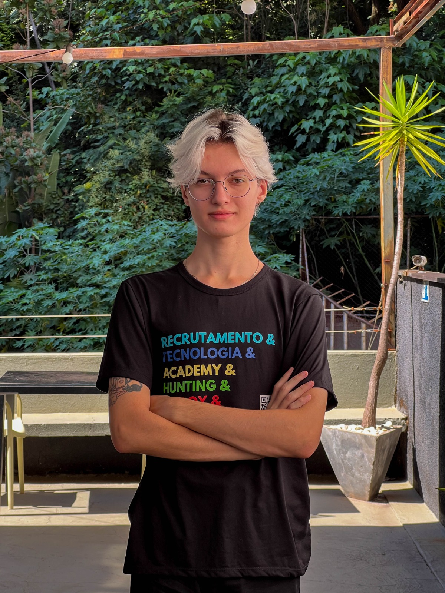

# Pet Parent

<a href="Pet Parent">
    
  </a>
<p align="center">
  

  

  <a href="https://github.com/RaphMt117/Pet-Parent/commits/main">
    
  </a>

  <!--  -->

   <a href="https://cubos.academy/">
    
   </a>

   <a href="https://github.com/RaphMt117/Pet-Parent/stargazers">
    
  </a>

</p>
<h1 align="center">
    
</h1>

<h4 align="center"> 
	🚧 Pet Parent 🚧
</h4>

<p align="center">
	
</p>

<p align="center">
 <a href="#-sobre-o-projeto">Sobre</a> •
 <a href="#-funcionalidades">Funcionalidades</a> •
 <a href="#-layout">Layout</a> • 
 <a href="#-como-executar-o-projeto">Como executar</a> • 
 <a href="#-tecnologias">Tecnologias</a> • 
 <a href="#-contribuidores">Contribuidores</a> • 
 <a href="#-autor">Autor</a> • 
 <a href="#user-content--licença">Licença</a>
</p>


## 💻 Sobre o projeto

📄 Pet Parent Projects


Projeto desenvolvido durante a **Faculdade** de [ [ Análise e Desenvolvimento de Sistemas ](https://www.una.br/graduacao/analise-e-desenvolvimento-de-sistemas/?gad_source=1&gclid=CjwKCAjwx-CyBhAqEiwAeOcTdZ4_jPG42MPBBNPy-D6ymLMlDzXNEg-9qaahYUMV25BeF9d7G1m5pRoCjMsQAvD_BwE) ] pela [Una Betim](https://www.una.br/unidades/betim/).

---

## ⚙️ To do

- [ ]  Usuários:
    - [x] Autenticação de Usuário
    - [ ] Alteração de características
    - [x] Implementação Firebase
    - [ ] 

---

---

## 🛣️ Como executar o projeto

Este projeto é divido em três partes:
1. **Backend** 
2. **Frontend**


💡 Necessário o Frontend e Backend serem executados para funcionar.

### Pré-requisitos

Antes de começar, você vai precisar ter instalado em sua máquina as seguintes ferramentas:
[Maven](https://maven.apache.org), [Java 17](https://www.oracle.com/br/java/technologies/downloads/#java17).
Além disto é bom ter um editor para trabalhar com o código como [VSCode](https://code.visualstudio.com/) ou [IntelliJ](https://www.jetbrains.com/idea/).

#### 🎲 Rodando o Backend (servidor)

```bash

# Clone este repositório
$ git clone git@github.com:RaphMt117/Pet-Parent.git

# Acesse a pasta do projeto no terminal/cmd
$ cd Pet-Parent/backend

# Instale as dependências
$ mvn clean install

# Execute a aplicação em modo de desenvolvimento 
$ 

# O servidor inciará na porta:8080 

```

#### 🧭 Rodando a aplicação web (Frontend)

```bash

# Clone este repositório
$ git clone git@github.com:RaphMt117/Pet-Parent.git

# Acesse a pasta do projeto no seu terminal/cmd
$ cd Pet-Parent/frontend

# Instale as dependências
$ npm install

# Execute a aplicação em modo de desenvolvimento
$ npm run start

# A aplicação será aberta na porta:3000 - acesse http://localhost:3000

```

---

## 🛠 Tecnologias

As seguintes ferramentas foram usadas na construção do projeto:

#### **Website**  ([Astro](https://astro.build)) 

-   **[JavaScript](https://developer.mozilla.org/pt-BR/docs/Web/JavaScript)**
-   **[Tailwind](https://tailwindcss.com)**

> Veja o arquivo [package.json](https://github.com/RaphMt117/Pet-Parent/blob/main/frontend/package.json)

#### **Server**  ([Spring](https://spring.io))

-   **[Java](https://www.oracle.com/br/java/technologies/downloads/#java17)**
-   **[Maven](https://maven.apache.org)**
-   **[Firebase](https://firebase.google.com/?hl=pt)**


> Veja o arquivo [pom.xml](https://github.com/RaphMt117/Pet-Parent/blob/main/backend/pom.xml)


#### **Utilitários**


-   API:  **[API]()**
-   Editor:  **[Visual Studio Code](https://code.visualstudio.com/) e [IntelliJ](https://www.jetbrains.com/idea/)**  
-   Commits:  **[Conventional Commits](https://www.conventionalcommits.org/pt-br/v1.0.0/)**
-   Ícones:  **[Feather Icons](https://feathericons.com/)**,  **[Font Awesome](https://fontawesome.com/)**

---

## 👨‍💻 Contribuidores

Um praise para os desenvolvedores que contribuíram neste projeto 👏

<table>
  <tr>
    <td align="center"><a href=""><br /><sub><b>Rafael Marques</b></sub></a><br /><a href="frontend/public/rafael-marques-icon.jpg" title="Rafael Marques">👨‍💻</a></td>
    <td align="center"><a href=""><br /><sub><b>Davi Nicoletto</b></sub></a><br /><a href="frontend/public/davi-nicoletto.jpeg" title="Davi Nicoletto">👨‍💻</a></td>
    <td align="center"><a href=""><br /><sub><b>Davi Dias</b></sub></a><br /><a href="frontend/public/davi-dias-icon.jpg"Davi Dias">👨‍💻</a></td>
  </tr>
</table>

## 💪 Como contribuir para o projeto

1. Faça um **fork** do projeto.
2. Crie uma nova branch com as suas alterações: `git checkout -b my-feature`
3. Salve as alterações e crie uma mensagem de commit contando o que você fez: `git commit -m "feature: My new feature"`
4. Envie as suas alterações: `git push origin my-feature`
> Caso tenha alguma dúvida confira este [guia de como contribuir no GitHub](https://docs.github.com/pt/get-started/exploring-projects-on-github/contributing-to-a-project)

---

## 📝 Licença

Este projeto esta sobe a licença [MIT](LICENSE).

Feito com ❤️ por Rafael Marques👋🏽 [Entre em contato!](https://www.linkedin.com/in/rafael-marques-e-torres/)
<br>
Feito com empenho Davi Nicoletto👋🏽 [Entre em contato!](https://www.linkedin.com/in/davi-nicoletto/)
<br>
Feito com carinho pelo Davi Dias 👋🏽 [Entre em contato!](https://www.linkedin.com/in/davidiasads/)


